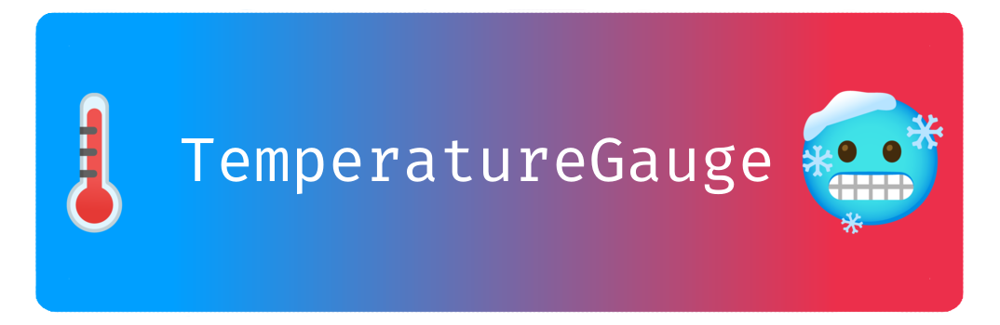
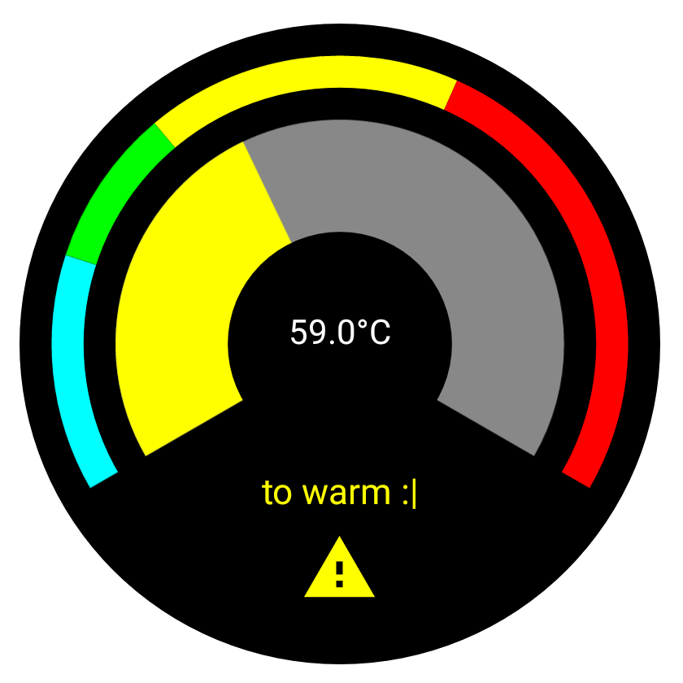
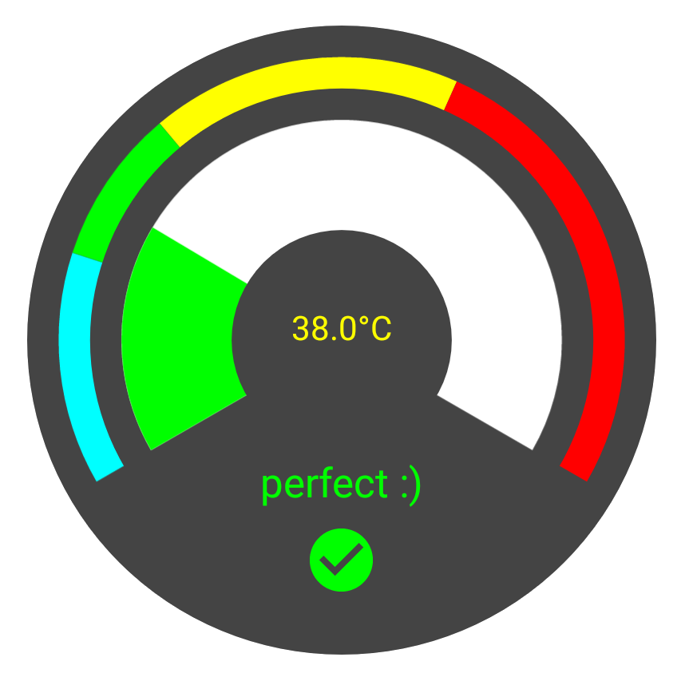

<div align="center">
  
</div>

<p align="center">
    <a href="https://github.com/free-bots/TemperatureGauge/releases" alt="GitHub release (latest by date)">
        </a>
    <a href="https://github.com/free-bots/TemperatureGauge/blob/master/LICENSE" alt="License">
        </a>
    <a href="https://github.com/free-bots/TemperatureGauge/graphs/contributors" alt="Contributors">
        </a>
</p>


# Table of Contents

- [Installation](#installation)
- [Requirement](#requirement)
- [API](#api)
	- [Layout Usage](#layout-usage)
    - [Code Usage](#code-usage)
    - [Custom Color Scheme](#custom-color-scheme)
    - [Custom Temperature Text](#custom-temperature-text)
- [Demo Application](#demo-application)
- [Contribution](#contribution)
- [License](#license)

## Installation
Add the import statement to the `build.gradle` of your module:

```gradle
implementation 'com.github.free-bots:TemperatureGauge:1.0.0'
```

## Requirement

- The minimum Android SDK version is 23.

## API

### Layout Usage

To use the library add the xml tag to your layout:

```xml
<to.freebots.temperaturegauge.TemperatureGauge
     android:id="@+id/gauge"
     android:layout_width="match_parent"
     android:layout_height="300dp"
     android:layout_margin="50dp"
     app:layout_constraintBottom_toTopOf="@+id/sb_temperature"
     app:layout_constraintEnd_toEndOf="parent"
     app:layout_constraintHorizontal_bias="0.0"
     app:layout_constraintStart_toStartOf="parent"
     app:layout_constraintTop_toTopOf="parent"
     app:layout_constraintVertical_bias="0.0" />
```

### Code Usage
After adding the xml tag to the layout appy your range config to the gauge:

```kotlin
gauge.config = arrayListOf(
    TemperatureRangeConfig(
        30F, // max temperature of the range
        Color.CYAN, // color of range
        "to cold!", // info text (optional)
        ContextCompat.getDrawable(applicationContext, R.drawable.ic_cold) // icon (optional)
    ),
    TemperatureRangeConfig(
        50F, Color.GREEN, "perfect :)",
        ContextCompat.getDrawable(applicationContext, R.drawable.ic_ideal)
    ),
    TemperatureRangeConfig(
        90F, Color.YELLOW, "to warm :|",
        ContextCompat.getDrawable(applicationContext, R.drawable.ic_warm)
    ),
    TemperatureRangeConfig(
        MAX_TEMP,
        Color.RED,
        "to hot >:(",
        ContextCompat.getDrawable(applicationContext, R.drawable.ic_hot)
    )
)
```

Define min and max temperature `important the range must be identical to the range config` if the min and max temperature is not consistent with the range config an exception will be thrown:

```kotlin
gauge.minTemperature = 0F
gauge.maxTemperature = 150F
```

Set the current temperature with:

```kotlin
gauge.temperature = 0F
```

### Custom Color Scheme

```kotlin
gauge.tintIcons = true // tint icons with the color of the configuration

// define your color scheme here
gauge.gaugeBackgroundColor = Color.DKGRAY
gauge.temperatureTextColor = Color.YELLOW
gauge.temperatureArcBackgroundColor = Color.WHITE
```

<div align="center">
  
</div>

### Custom Temperature Text

If you want a different text for the temperature change the render interface:

```kotlin
// change the rendered text of the gauge
gauge.temperatureRender = object : TemperatureGauge.TemperatureRender {
    override fun renderText(temperature: Float): String = "$temperature °C :)"
}
```

## Demo Application

If you want to see the library in action clone the project with Android Studio and build it.

```
git clone https://github.com/free-bots/TemperatureGauge.git
```

## Contribution

If you miss an important feature fell free to contribute or create an feature request.

## License

> MIT License

> Copyright (c) 2020 free-bots

> Permission is hereby granted, free of charge, to any person obtaining a copy
of this software and associated documentation files (the "Software"), to deal
in the Software without restriction, including without limitation the rights
to use, copy, modify, merge, publish, distribute, sublicense, and/or sell
copies of the Software, and to permit persons to whom the Software is
furnished to do so, subject to the following conditions:

> The above copyright notice and this permission notice shall be included in all
copies or substantial portions of the Software.

> THE SOFTWARE IS PROVIDED "AS IS", WITHOUT WARRANTY OF ANY KIND, EXPRESS OR
IMPLIED, INCLUDING BUT NOT LIMITED TO THE WARRANTIES OF MERCHANTABILITY,
FITNESS FOR A PARTICULAR PURPOSE AND NONINFRINGEMENT. IN NO EVENT SHALL THE
AUTHORS OR COPYRIGHT HOLDERS BE LIABLE FOR ANY CLAIM, DAMAGES OR OTHER
LIABILITY, WHETHER IN AN ACTION OF CONTRACT, TORT OR OTHERWISE, ARISING FROM,
OUT OF OR IN CONNECTION WITH THE SOFTWARE OR THE USE OR OTHER DEALINGS IN THE
SOFTWARE.
